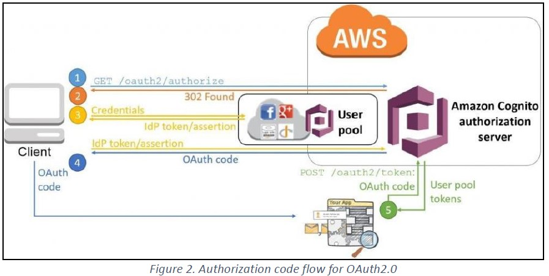
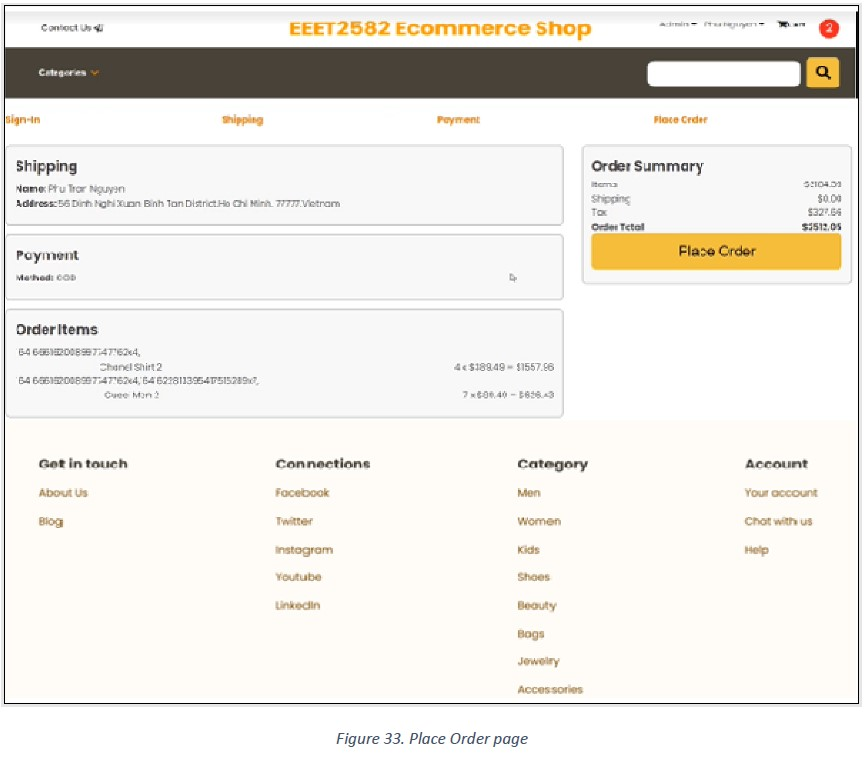

EEET2582_Team6_Ecommerce_App
- Because the project zip is quite large to upload in Github, so please visit it via following OneDrive Link: https://rmiteduau-my.sharepoint.com/:f:/g/personal/s3811248_rmit_edu_vn/Eu8sDW3_gq1IjoVGkAcR5osBpEkSaFX_adZkEbLvDW98Dg?e=TrbCwB

## There are four folders:
1. UI_deployment folder: mvn clean install -> put it in AWS Elastic Beanstalk -> yay, it works!
2. UI folder: Run Locally - Frontend ReactJS Redux
3. Kubernetes folder: 3 yaml files to deploy backend, kafka, zoo, and redis to Kubernetes
4. production_eeet2582_ecommerce_backend: Backend folders

## Much more details about instruction, architecture, and explanation are shown in the Report PDF.

# Demo

 
 
 
 
 
 
 
 
 
 
 
 
 
 
 
 
 
 
 
 
 
 
 
 
 
 
 
 
 
 
 
 
 
 
 
 
 
 
 
 
 
 
 
 
 
 
 
 
 
